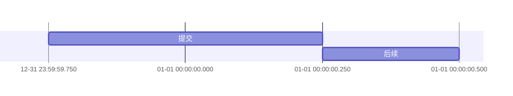

# 第四组第七批：Gantt 日期时间与日历刷新

更新：2026-09-26。开发基线：`f891e971bf365fbb75d422f0a0033eb404a79c2c`。

本批交付日期时间解析、时间轴刻度、宿主本地日期刷新、成功/拒绝回归与真机验收标准。优先交付到 GitHub `main`，核心检查在 `yu-workspace` 执行。未修改 CI 配置、依赖锁文件或导出功能；应用打包、真实跨午夜/睡眠唤醒和统一实窗验收尚未执行。

## 日期时间支持范围

`dateFormat` 控制输入解析，`axisFormat` 控制轴文字；两者不能互相替代。日期格式按字段与分隔符严格匹配，不自动把非法日期归一化成下个月，也不丢弃时分秒后再排程。

| 输入字段 | 支持与约束 |
| --- | --- |
| 年 | `YYYY`、`YY`；两位年 `00..68` 为 `2000..2068`，`69..99` 为 `1969..1999` |
| 月、日 | `M/MM`、`D/DD`；固定双位格式要求补零，单字段格式允许一或两位 |
| 24小时制 | `H/HH`、`m/mm`、`s/ss`；小时 0..23，分秒 0..59 |
| 12小时制 | `h/hh` 必须与 `a/A` 配合，分别严格匹配小写 `am/pm` 或大写 `AM/PM` |
| 小数秒 | `S/SS/SSS`，分别为十分之一秒、百分之一秒、毫秒，要求对应位数 |
| 字面量 | 标点、中文等非 ASCII 字母数字、ISO `T`；其他字母使用 `[ at ]` 等括号字面量，字段本身不允许重复 |
| 部分日期 | 仅年、年/月可省略后续字段，缺失月/日取 1；不支持缺少年份的月/日输入 |
| 纯时间 | 如 `HH:mm`、`HH:mm:ss.SSS`、`hh:mm A`，使用宿主提供的 `reference_day`；未提供上下文的直接库调用固定使用 1970-01-01，不读取 helper 的系统时钟 |

内部日期时间统一保留为 `YYYY-MM-DDTHH:mm:ss.SSS`；纯日期仍为 `YYYY-MM-DD`。这是渲染模型表示，不改写编辑器中的 Mermaid 原文。任务起止、`after`、`until` 及月/年时长保持时间部分；修正了 Unix epoch 之前负日数使用 `fract()` 时丢失正确日内位置的问题。排程限定在公元 1..9999 年及既有区间/资源上限内。

示例：



本批没有声称支持完整 Day.js 或 Mermaid 日期格式集合。输入中的本地化月份名、序数日、季度、年内日数、Unix `X/x`、`Z/ZZ` 时区偏移等仍明确拒绝。`24:00`、闰秒、重复字段、残缺字面量和多余尾部文字拒绝。纯时间显式结束值早于开始值时，不暗中推断为次日：`23:55,00:05` 拒绝；可写 `23:55,10m`，或写完整跨日日期时间。

## 时间轴与排程边界

`tickInterval` 支持正整数加 `millisecond/second/minute/hour/day/week/month`，不接受零、负数、前导零或未知单位。秒、分、时刻度按所属日历字段对齐；日刻度沿用月内字段重置，周刻度沿用 `weekday`，月刻度按真实月份推进，不用固定30天代替。未指定刻度的短日期时间图自动选择子日刻度，避免多次显示同一天而看不到时间变化。

`axisFormat` 支持 `%Y %y %m %d %e %H %I %M %S %L %p %j %w %a %A %b %B %x %X %%`。月份/星期名称固定为英文，不冒充系统语言本地化。格式化先拆分整数毫秒、日期与日内时间，不用四舍五入整日把下午显示成次日。

日期时间轴按实际测量的标签宽度预留相邻刻度间距，必要时扩展图宽并保护最左标签，不通过删除刻度来掩盖重叠。输出仍受既有 SVG 几何/字节上限约束；2048个是刻度数量上限，不承诺任意长度的2048个标签都能生成有限尺寸图片。

刻度在解析完成后、布局之前生成并验证，最多2048个，超限返回诊断，不静默截断后半段。新增边界用例发现浮点日数换算会漏掉恰在末端的毫秒刻度；现仅在浮点表示误差范围内吸附到整数毫秒，保留2048/2049刻度的正反例。

时间轴仍是民用日期加日内时间的坐标，固定单位按一天86400秒换算，不是带时区偏移的绝对时刻排程。宿主跨夏令时正确计算下一本地日边界，不等于图中已实现夏令时23/25小时的真实耗时推导。`todayMarker` 仍表示本地日期起点，不是秒级实时“现在”指针。

`inclusiveEndDates` 沿用既有显式结束值加一日的规则，包括带时间的显式结束值；时长和 `until` 不因此加一天。`excludes/includes` 沿用日期粒度及现有逐日检查逻辑，不新增按小时扣除工作时间的日历。排除日期可用已支持的纯日期格式或 ISO 日期；不会把含空格的日期时间排除项默默拆开后当作有效日期。

语义参考：[Mermaid Gantt 文档](https://mermaid.js.org/syntax/gantt.html)、[Day.js 严格格式解析](https://day.js.org/docs/en/parse/string-format)、[Day.js 字面量规则](https://day.js.org/docs/en/display/format)、[Mermaid Gantt 日期检查源码](https://github.com/mermaid-js/mermaid/blob/develop/packages/mermaid/src/diagrams/gantt/ganttDb.js)、[D3 时间刻度](https://d3js.org/d3-time)。这些资料用于确认格式与边界，不代表 Yu 已完整兼容全部上游功能。

## 跨日、时区与唤醒链路

原代码已有 `reference_day` 传输、FFI 资源失效和日历通知。本批复用该链路，修正“Swift 认为帧未变化便提前返回，尚未检查日历”的顺序问题：每次提交先检查本地日历，日期变化时清理 Swift 的旧帧快照，再进入 retained-frame 判断。即使随后的 native submit 忙或失败，也不能把旧日期快照当成新日期已提交。

新增 `RenderCalendarContext` 独立维护当前民用日期、时区对象和实际本地日区间。通知使区间缓存失效，但保留最后成功发布的日数；同一天重复通知不会重新取消资源工作。仅在 FFI 接受新日数后提交缓存，失败可重试。睡眠跨多日、时钟回拨和时区切换都重新取实际日数，不简单执行 `day += 1`。

可见且活动的 surface 使用一个主 RunLoop 单次定时器，在下一本地日边界请求刷新；不是每秒/每分钟轮询。边界来自 `Calendar.dateInterval`，覆盖夏令时23/25小时日。定时器使用弱所有者与代际票据；覆盖/失活/睡眠/解绑时取消，旧回调不能重新唤起已取消的工作。隐藏状态收到通知也使日历缓存失效，重新可见、激活或唤醒后补查。

宿主保留日历变化、系统时区/时钟变化、应用激活、窗口遮挡和 `NSWorkspace` 唤醒通知，并补失活、睡眠和会话恢复处理。工作区睡眠/唤醒事件仍注册到工作区自己的通知中心。依据：[Apple didWakeNotification](https://developer.apple.com/documentation/AppKit/NSWorkspace/didWakeNotification)、[Calendar 本地日边界](https://developer.apple.com/documentation/foundation/calendar/startofday(for:))。

FFI 日历更新不是编辑事务，不改变文档源码、修订、选区、撤销/重做分支或已保存字节。新增测试在已有输入撤销后保留重做分支，再执行跨日、同日重复、回拨和非法日数请求，最后验证重做仍可恢复输入；BOM/LF/CRLF 四组合均覆盖。

## 本轮已执行检查

| 检查 | 实际结果 |
| --- | --- |
| `cargo test -p yu-document-renderer --locked` | 111通过、0失败、1忽略 |
| 总数构成 | 75库测试、1协议帧、5客户端、16日期时间集成、14时序集成；不重复累加 |
| `cargo test -p yu-storage-ffi --lib reference_day` | 2通过，覆盖旧资源取消/同日不取消及完整历史/字节保留 |
| helper + FFI 全 target 的 Clippy，`-D warnings` | 通过，未放宽 lint |
| 独立 Swift 日历检查，`-swift-version 5 -warnings-as-errors` | 7组通过：午夜、多日/回拨、时区、夏令时、发布失败重试、非法日期、定时器回收 |
| macOS 宿主全部 Swift 源码 `swiftc -typecheck` | 通过，使用本仓库 FFI 头文件生成临时 module map；无应用链接/打包 |
| 10个本轮 Rust 文件 `rustfmt --check` | 通过；不声称整个仓库格式检查 |
| 既有60秒 helper 空闲退出测试 | 默认忽略，本轮未执行 |
| 应用打包、真实跨午夜/睡眠唤醒、AppKit图像与实窗、保存完全退出重开 | 未执行 |

最终 helper 记录 `wc_job_etWcQhzHpLlHkAGT`、Clippy `wc_job_lwWEwTu9zsa23f9u` 和 FFI `wc_job_CiJJT85NF3mD77r2` 均已退出且返回0。初次集成测试的类型名错误和刻度边界失败已修正后重跑，不改写初次失败事实。本轮未重跑整个 Rust workspace，也不将第五批853项结果作为本轮证明。

关键入口：

```sh
cargo test -p yu-document-renderer --locked
cargo test -p yu-storage-ffi --lib reference_day
cargo clippy -p yu-document-renderer -p yu-storage-ffi --all-targets -- -D warnings
swiftc -swift-version 5 -warnings-as-errors \
  platform/macos/yu-shell-macos/Sources/Yu/RenderCalendarContext.swift \
  platform/macos/yu-shell-macos/Tests/RenderCalendarChecks.swift \
  -o /tmp/yu-render-calendar-checks
/tmp/yu-render-calendar-checks
```

独立 Swift 检查已加入 `run-self-checks.sh` 的无窗口检查部分；本轮只执行对应检查，不声称整份脚本或应用自检通过。

## 真机固定语料与验收标准

复制 `platform/macos/yu-shell-macos/Fixtures/group4-gantt-calendar.md` 后测试：前四段为有效图，最后两段分别为无效时刻和刻度超限的预期诊断。固定语料本身已按 LF/CRLF 进入 helper 回归；不等于已通过窗口验收。

1. 拉取本批提交并记录 SHA，按原流程打包，记录应用和随包 helper 哈希；从隔离文档确认日期/时间/毫秒、12小时制、真实月份刻度和中英文标签。有效图不能变成普通文本或旧图。
2. 前台不输入也不滚动，跨本地午夜后检查纯时间图轴上的日期更新。相对图和今日标记可能一起移动，相对横坐标不变不代表没刷新，应同时核对轴日期和显式日期图。
3. 使用专用测试环境分别验证睡眠跨日、多日后唤醒、隐藏后显示、锁定后恢复、时区变化及时间回拨。不得为验收擅自修改生产机器时钟；注入式核心测试只验证逻辑，真实通知链路仍需单独记录。
4. 日期变化前保留已有输入和可重做分支，之后核对修订、源码、完整选区、保存状态及字节不变。重复同日事件不得反复创建 helper；旧日期的迟到资源结果不得覆盖新日期。
5. 对两个故意错误场景修改、修复、撤销/重做，检查诊断跟随当前源码，错误不污染后续有效图。浅色/深色都检查，含BOM/CRLF文件保存、完全退出重开后继续编辑。
6. 关闭窗口、切到无图文档和退出应用后，核查定时器、通知观察者、运行中请求及 helper 回收；与第四组统一资源审计绑定同一构建，不以本批7组无窗口检查代替审计。

下一阶段：冻结一个明确构建，完成第四组综合实窗回归与资源回收审计。现阶段不追加导出功能、不插入CI修复，也不把上述待验收项写成第四组已结项。
