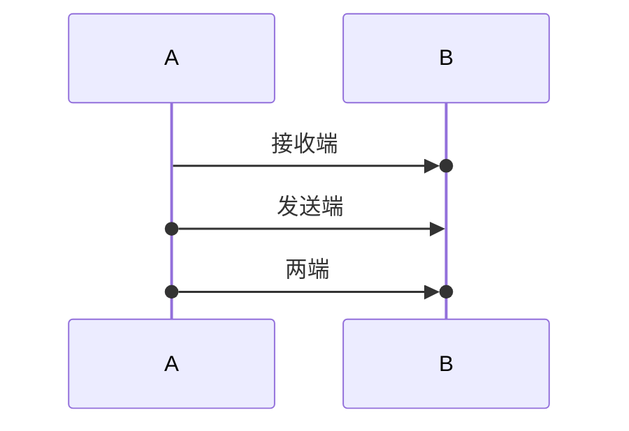

# 第四组第六批：Mermaid 时序中心连接与生命周期组合

更新：2026-09-26。开发基线：`843eddec1b433f64f31564a694d9485d8413de23`。

后续状态：本批已合入 `f891e971`。Gantt 日期时间与日历刷新已由[第七批](mac-group4-gantt-calendar.md)继续交付；下方94项结果是第六批历史结果，当前状态以状态入口为准。

本批只修改时序图的解析、布局、原生 SVG 输出与回归。Gantt 日期格式、跨日/唤醒刷新留给下一批，不提前开发导出，不修改 CI 配置。交付到 GitHub `main`；本机检查与应用打包、实窗验收分开记录。

## 中心连接语义

支持三种位置，`()` 是独立的连接端点标记，不属于参与者名字，也不代替箭头：



已有 28 种箭头 token 与中心连接共用完整 token 解析，保留实/虚线、普通/开放/半箭头、双向箭头和交叉终止标记。反向箭头先规范化真实发送者/接收者，再对应交换连接标记的身份；标签中的 `()`、`+`、`-` 和箭头文字不作语法。

`()` 不增加或减少激活深度。需要激活时使用独立的 `activate B` / `deactivate B`；不接受 `A()->>+B`、`A->>+()B`、`A->>()-B` 等混写，也不容忍重复 `()()`、残缺括号或多余箭头字符。预检与正式解析使用同一消息身份解析入口，不能生成名为 `()B`、`+B` 的假参与者。

## 几何与原生绘制

连接标记作为独立的 `SequenceConnectionLayout` 保存消息序号、参与者、发送/接收端和圆几何，不复用激活事件或箭头头型。普通消息的圆心在对应生命线上；自调用的发送端和接收端分别取发送、返回的高度。线段/箭头端点按半径内缩，圆、箭头和销毁叉号分别绘制，不依赖 SVG marker 或外部图片。

创建消息沿用原有“连接新参与者头部”的优先规则：普通 participant 连接矩形头部朝向发送者的一侧，actor 连接人物主体中心。中心圆标记使用这一实际连接位置，不画穿新参与者的标题文字。该规则是 Yu 原生几何合同，不宣称逐像素复刻 Mermaid 浏览器输出。

圆的尺寸随字体缩放，进入布局边界、整体平移与消息标签避让计算；自动编号为发送端圆额外预留半径，防止数字遮住圆。浅/深色使用现有主题的生命线颜色。布局不变量检查圆的有限坐标、正半径、画布范围以及消息端点身份。

## 生命周期组合与明确边界

- 创建只允许接收者，保留 actor/participant 类型与别名；重复创建、创建消息发自新参与者、自创建或缺少紧随的关联消息继续诊断。
- 销毁可以关联发送者、接收者或自调用；生命线和全部嵌套激活条在对应消息位置截止，销毁者不再生成底部镜像。销毁后的消息/激活及不相关的销毁消息拒绝。
- 一条消息可以创建新的接收者并销毁已有的发送者，两条指令的书写先后不会交换身份；不支持先创建再立即销毁同一个尚未接收创建消息的参与者。
- 普通行内 `+` 仍激活接收者，`-` 仍结束发送者的激活。新增深度检查：结束未激活参与者、在销毁消息上重新激活被销毁者均诊断；中心圆本身不能为 `deactivate` 提供一次虚假激活。
- 激活事件区分“消息内后缀”和“独立指令”。独立指令锚定此前消息的完成位置，并保留此前 Note 的顺序，不再错误延伸到下一条消息。自调用的激活/结束使用返回段高度。已闭合激活条不会为满足最小高度越过结束事件；零高区间不虚构可见条。
- 未显式结束的激活继续延伸到可见生命线末端，但不得越过创建/销毁边界。嵌套深度保留，销毁时一起截断。
- `loop`、`alt/else`、`par/and`、`critical/option` 内的连接消息继续参与同一源码顺序的图示时间线。本批没有实现分支执行器或路径敏感的对象生命周期推导，不在分支切换时自动复制参与者、重置激活栈或允许同名对象重新创建。

语义依据：2026-09-26 核对的 [Mermaid 官方时序文档](https://mermaid.js.org/syntax/sequenceDiagram.html)、[官方 Jison 消息语法](https://github.com/mermaid-js/mermaid/blob/develop/packages/mermaid/src/diagrams/sequence/parser/sequenceDiagram.jison)、[官方序列状态管理](https://github.com/mermaid-js/mermaid/blob/develop/packages/mermaid/src/diagrams/sequence/sequenceDb.ts)。中心连接三种语法与 `+/-` 在上游是不同产生式；本批不借此宣称已支持上游全部参与者类型、配置或完整 Mermaid 12。

## 回归与历史测试演进

新增 `tools/yu-document-renderer/tests/sequence_connections.rs`，14 项集成回归。包括 28 种箭头 × 2 种空间顺序 × 3 种连接位置 × 浅/深色的 336 次渲染矩阵，以及五种字体尺寸的编号避让/边界、Unicode 别名、标签字面括号、自调用、动态创建、销毁双方、嵌套激活、Note 顺序、分支框、非法语法和 UTF-8/CRLF 重建。矩阵次数不额外计算成测试函数数。

原有半箭头测试中的合法 `->>()` 拒绝断言改为真正非法的 `->>()()`；已支持的形式由成功矩阵覆盖。旧箭头头型测试使用 `-` 却未激活发送者，现补齐前置激活而保留头型断言；未激活结束另外纳入失败回归。初次新增碰撞测试确实发现自动编号遮住中心圆，已修改几何间距并保留断言。

`tests/client.rs` 新增真实 helper 子进程回归：合法中心连接/生命周期请求 → 非法激活诊断 → 合法请求恢复，保持同一子进程，检查不同修订和过期请求拒绝。沿用现有取消和子进程回收回归。UTF-8 重建和 helper 请求不是应用保存、完整退出重开、编辑事务或整窗验收。

```sh
cargo test -p yu-document-renderer
cargo clippy -p yu-document-renderer --all-targets -- -D warnings
```

本轮在 `yu-workspace` 实际执行的最终结果：

| 检查 | 结果 |
| --- | --- |
| `cargo test -p yu-document-renderer --locked` | 94 通过、0 失败、1 忽略 |
| 上述总数构成 | 75 项库测试、1 项协议帧测试、4 项客户端测试、14 项中心连接/生命周期集成测试 |
| `cargo clippy -p yu-document-renderer --all-targets -- -D warnings` | 通过，未放宽 lint |
| 本轮 10 个 Rust 文件的 `rustfmt --check` | 通过；不声称全仓格式通过 |
| 真实 helper 的错误恢复/旧修订拒绝、既有运行中取消/进程回收 | 已执行，包含在上面的客户端测试中 |
| 既有真实 60 秒空闲退出/重启用例 | 默认忽略，本轮未运行，不计作资源审计通过 |
| 应用打包、AppKit 图像复核、实窗交互、保存完全退出重开 | 未执行 |

最终重跑记录 `wc_job_4Xl9pGYoD9h87ka_` 和 Clippy 记录 `wc_job_d_Ja-f25Pw2iB2wc` 均以退出码 0 完成。测试经生产 helper 入口编译和调用仓库内的 patched renderer；单独从根 workspace 运行供应商包单测的尝试被 Cargo 的非成员/开发依赖规则拒绝，未声称其完整供应商测试通过，也未为此改动 workspace 或锁文件。本轮没有重跑前五批的全编辑器测试，历史 853 项结果仍归第五批。

## 真机固定语料与验收步骤

使用隔离副本：`platform/macos/yu-shell-macos/Fixtures/group4-sequence-central.md`。其中前三段图应正常生成，后两段专门检查“未激活就结束”和“中心连接混写激活后缀”的诊断；不应把故意错误算作有效图渲染失败。第一段与自动化 `.mmd` fixture 逐字核对，LF/CRLF 均测试；文档 BOM 及真实输入法仍由真机验收。

1. 拉取本批 `main` 并记录提交 SHA，按既有流程打包，记录应用和随包 helper 哈希；不能用旧 helper 的截图证明本批通过。
2. 分别在浅/深色检查三种连接、普通/反向/半箭头、双向箭头、中文/emoji、自调用与编号：圆在正确端点，箭头和销毁叉号不消失，数字不遮圆，返回段不压到后续内容。
3. 检查新建 participant 与 actor 的头部、消息位置、生命线起点、销毁高度、底部存活镜像和全部嵌套激活条；尤其是一条消息创建接收者并销毁发送者的交接场景。
4. 在编辑器内修改圆标记、激活/结束指令、中文标签和参与者别名；检查点击定位、输入、一次撤销/重做及源码保留。修改一幅图不能改变另一幅图的状态。
5. 操作两段预期错误，再修复源码，反复撤销/重做。错误不得留下上次成功的伪正常图，也不得污染后续合法图；错误提示与当前源码修订一致。
6. 保存、完全退出应用、重开，重复检查显示、诊断、继续编辑及文件换行/BOM。收集当前构建的截图和逐项结果；最终与第四组资源回收审计合并，不以本批测试替代综合结项。

下一批：Gantt 日期格式与跨日/唤醒刷新。完成后冻结构建，进行第四组统一实窗回归与资源审计；第五组导出仍在其后。
