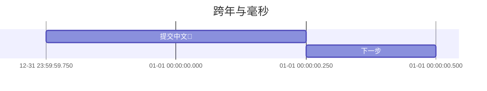
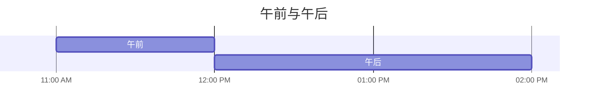

# 第四组：Gantt 日期与日历刷新

本文件是验收语料，不是通过记录。请复制后测试。前四段应正常渲染，最后两段必须显示诊断。
跨日测试应保持文档内容、修订和撤销历史不变；不要修改生产机器的系统时钟来模拟时间。

## 1. 纯时间：日期来自当前本地日历

跨日或睡眠后恢复时，轴日期应更新。相对任务与今日标记一起移动，标记的相对横坐标不一定改变；不要仅凭标记位置判定是否刷新。

```mermaid
gantt
title 本地日期与跨日刷新
dateFormat HH:mm
axisFormat %Y-%m-%d %H:%M
tickInterval 6hour
工作中文🙂 :a,00:00,26h
后续 :after a,2h
```



## 2. 显式日期与毫秒：不随本地日期重排



## 3. 12小时制：午夜和正午不能混淆



## 4. 月份刻度：不能以30天代替一个月


## 5. 预期诊断：无效时刻

```mermaid
gantt
dateFormat HH:mm
错误 :a,24:00,1h
```

## 6. 预期诊断：超过刻度资源边界


