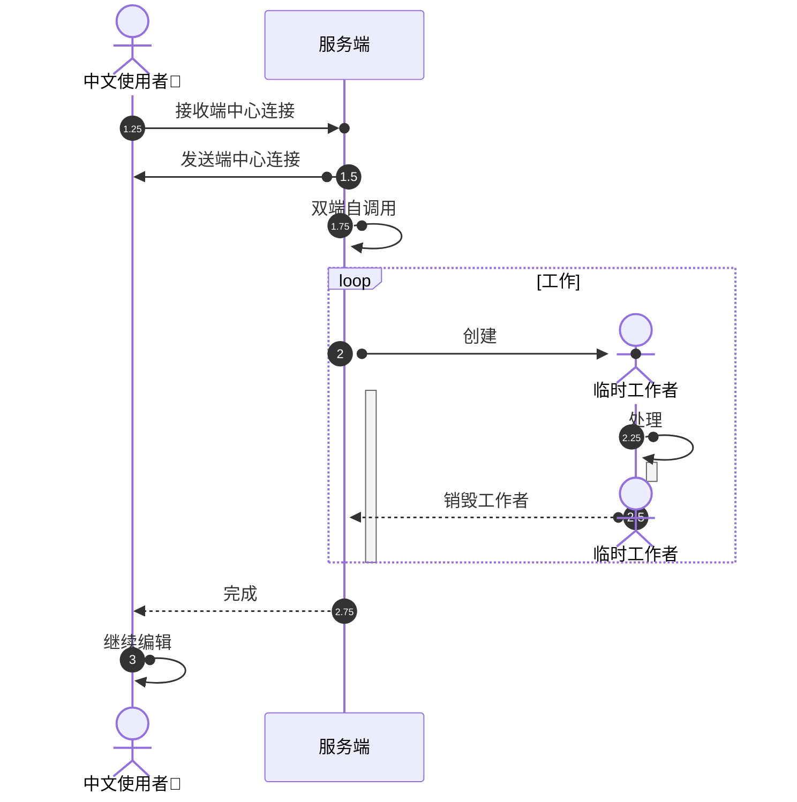
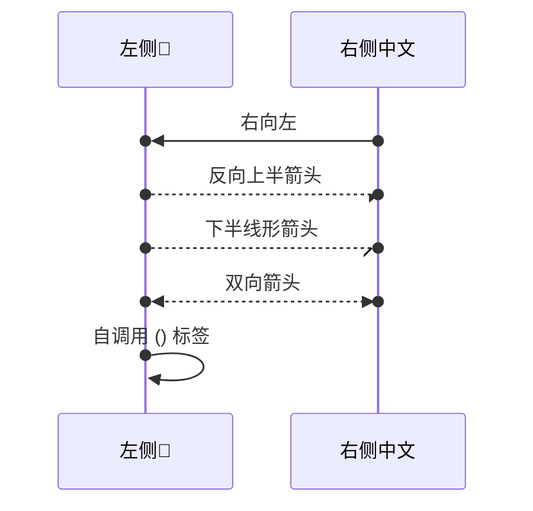

# 第四组：时序图中心连接与生命周期

固定验收语料，不是通过记录。请复制后编辑，分别检查浅色和深色；保存、完全退出、重新打开再核对。

## 三种连接与动态生命周期

圆标记应位于消息端点，不代替箭头，也不隐式激活参与者。自调用的两个标记应分别位于发送和返回高度。Worker 的创建头部、销毁叉号和激活条不得跑到别的参与者上。



## 反向与半箭头

上下半箭头保持原形状；反向连接的消息发送者与接收者不能被圆标记交换。文字里的括号和箭头只是标签内容。



## 一条消息同时创建接收者、销毁发送者

A 的生命线在交接消息处结束，B 从创建头部之后开始；底部仅保留存活的 B。

```mermaid
sequenceDiagram
participant A as 原工作者
activate A
create participant B as 新工作者
destroy A
A()->>()B: 交接
B()->>()B: 后续工作
```

## 预期诊断：中心连接不是激活

以下图应显示诊断并保留源码。将 `deactivate B` 改为 `activate B` 后应恢复；撤销和重做应恢复相应状态。

```mermaid
sequenceDiagram
A->>()B: 只有圆标记
deactivate B
```

## 预期诊断：不混写中心连接与激活后缀

以下图应显示诊断。改为 `A()->>B: 消息` 并在下一行写 `activate B` 后应恢复，不能悄悄生成名为 `+B` 的参与者。

```mermaid
sequenceDiagram
A()->>+B: 消息
```
