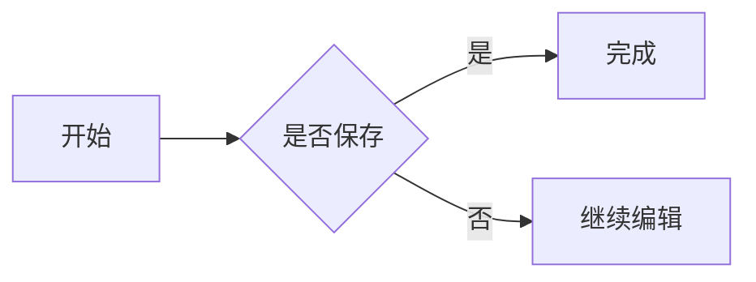
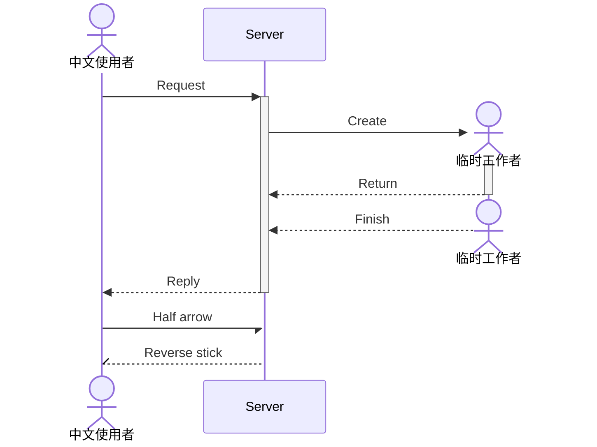
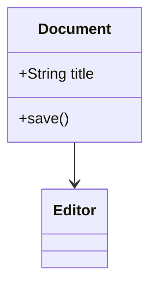
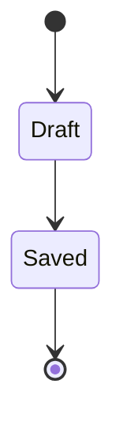
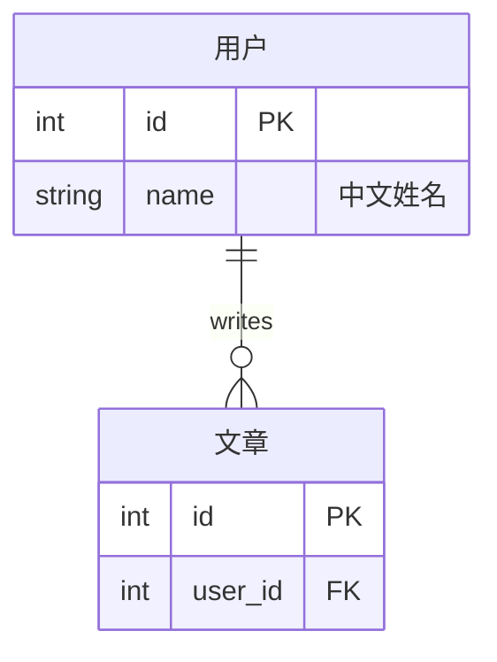
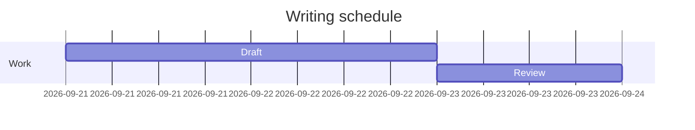
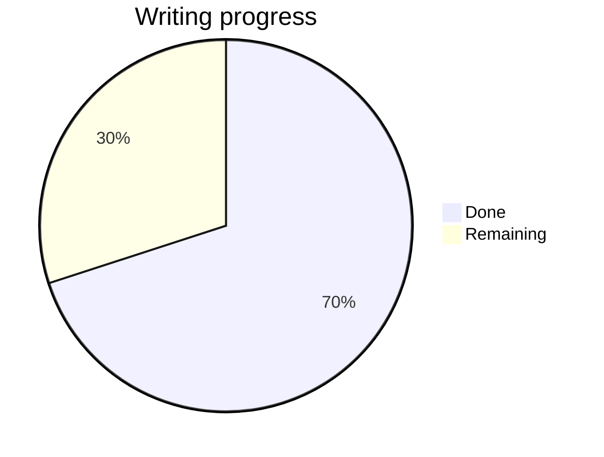

# Yu 第四组综合测试

这是一份固定语料，覆盖公式、七类图表、脚注、目录与有限 HTML。
它不是验收通过记录；测试方法与当前缺口见仓库的 mac-group4-status.md。

[TOC]

## 文字与脚注

普通中文、English、emoji 🙂、**强调**、*斜体*、`code`、==高亮==、H~2~O、x^2^。
链接：[Yu 仓库](https://github.com/xiaodou997/yu)。脚注入口[^note]。

[^note]: 中文脚注定义，包含 **强调**，用于检查双向跳转和编辑后的保存。

## 公式

行内公式 $E=mc^2$ 与正文同行。编号引用：\eqref{energy}。

$$
E=mc^2\label{energy}
$$

$$
\frac{1}{1+x^2}+\sqrt{a^2+b^2}
$$

$$
\begin{pmatrix}a&b\\c&d\end{pmatrix}
$$

$$
\begin{aligned}
\text{收益}&=a+b\\
\text{成本}&=c+d
\end{aligned}
$$

$$
f(x)=\begin{cases}x&x>0\\-x&x<0\end{cases}
$$

## 七类图表

### 流程图



### 时序图



### 类图



### 状态图



### ER 图



### 甘特图



### 饼图



## 有限 HTML

<p align="center">居中段落：<strong>强调</strong>、<em>斜体</em>、<mark>高亮</mark>、H<sub>2</sub>O。</p>

<blockquote><p>引用容器内的中文段落。</p></blockquote>

<ul><li>第一项<ul><li>嵌套项目</li></ul></li><li>第二项</li></ul>

<table><tr><th colspan="2">合并表头</th><th>普通列</th></tr><tr><td rowspan="2">跨行中文🙂</td><td>A</td><td>B</td></tr><tr><td>C</td><td>D</td></tr></table>

<details><summary>展开查看内容</summary><p>折叠容器的正文。</p></details>

## Markdown 表格与图片

| 标题 | 内容 | 对齐 |
| :--- | :---: | ---: |
| 中文 | **强调** | 1 |
| 目标 | 粘贴位置 | 2 |


## 预期错误语料

以下两项故意包含不支持的语法，应显示诊断并保留可编辑源码，不能画成伪成功结果。

$$
\unknownYuCommand{x}
$$

```mermaid
yuUnsupportedGraph
```

## 文档末尾

末尾中文输入、emoji 🙂、连续撤销重做与保存重开检查位置。
