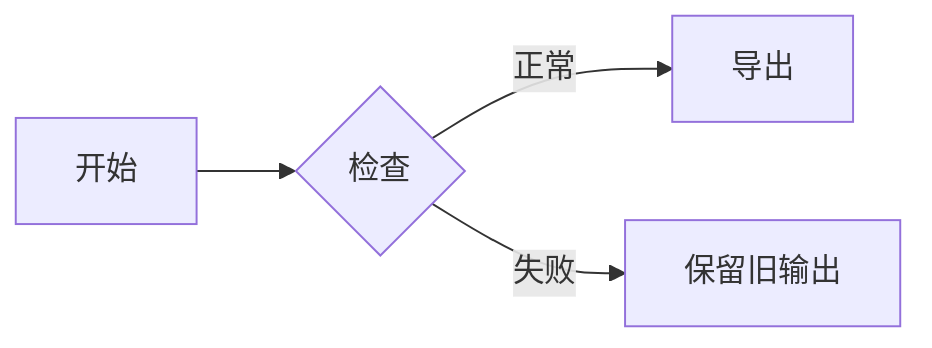
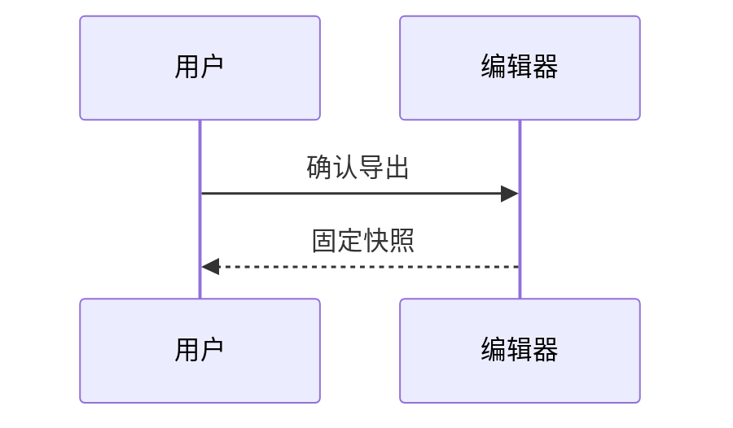
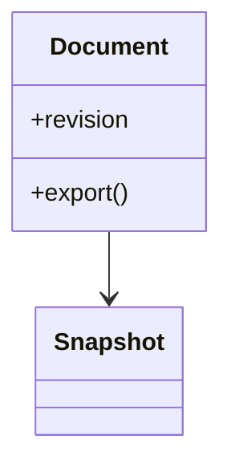
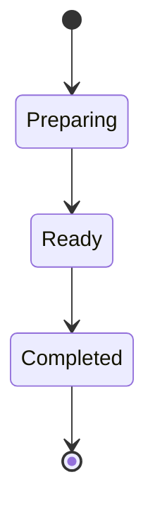
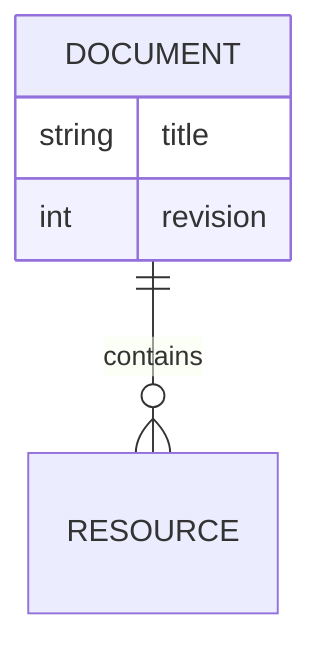
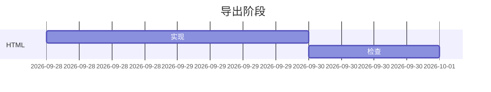
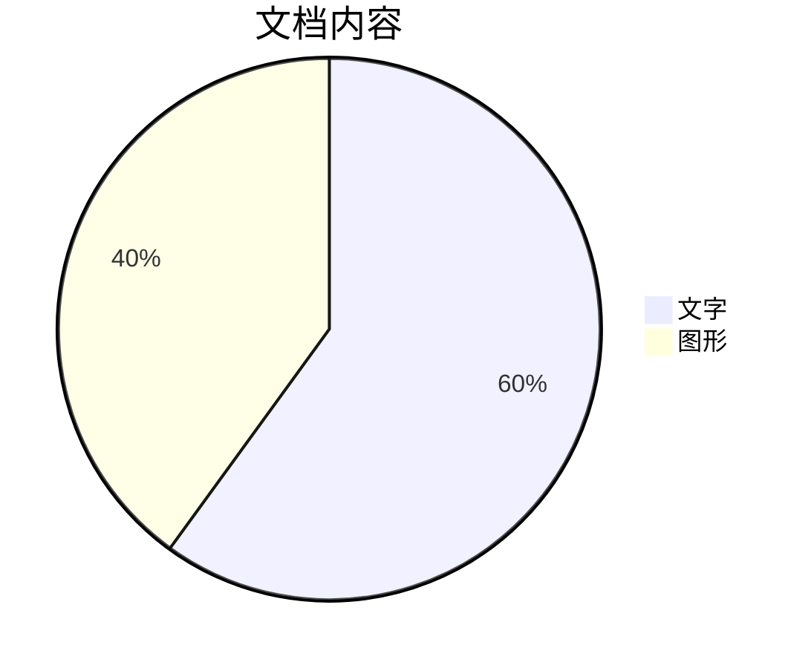

[TOC]

# Yu 内置 HTML 导出

这是一份独立的第五组固定语料，不修改第四组原件。中文、English、emoji 🙂、**粗体**、*斜体*、~~删除~~、==高亮==、H~2~O 和 x^2^。

正文链接 [OpenAI](https://openai.com)。脚注首次引用[^first]，稍后再次引用[^first]。

## 列表与代码

- 普通列表
  - 嵌套条目
- [x] 已完成
- [ ] 待完成

1. 第一项
2. 第二项

> 引用内容不会携带编辑器光标、选区或拼写线。

```rust
fn main() {
    println!("中文 <tag> & {}", 42);
}
```

## 公式与编号

行内公式 $a^2+b^2=c^2$。参见 \eqref{energy}。

$$
E=mc^2\label{energy}
$$

$$
\begin{bmatrix}1 & 2\\3 & 4\end{bmatrix}
$$

| 名称 | 内容 |
| --- | --- |
| 行内公式 | $x^2+y^2$ |
| 特殊文字 | 中文 & English 🙂 |

## 图表















## 有限 HTML、脚注与图片

<p align="center">居中正文 <strong>安全加粗</strong>。</p>

<table><thead><tr><th>类型</th><th>第一列</th><th>第二列</th></tr></thead><tbody><tr><td rowspan="2">合并</td><td><span data-math-style="inline">x^2</span></td><td><span data-yu-footnote="reference">[^second]</span></td></tr><tr><td colspan="2">合并后仍完整</td></tr></tbody></table>

<details><summary>折叠区域默认展开</summary><p>GROUP5-DETAILS-OFFSCREEN-CONTENT：所有正文都必须输出。</p></details>


## 重复标题

第一处重复标题内容。

## 重复标题

第二处重复标题内容。再次引用[^first]。

[^first]: 第一条文末注，包含 **加粗** 和 $n+1$。

[^second]: 从 HTML 表格引用的第二条文末注。

GROUP5-DOCUMENT-END-完整文档底部。
