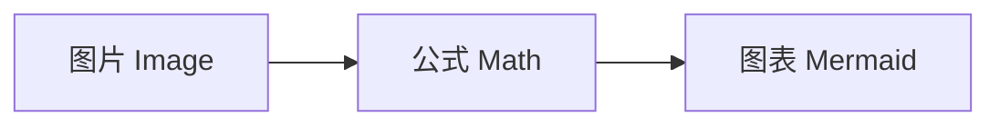

# Windows resources

中文 日本語 한글 — 😀 👩‍💻 👍🏽 𠀀 é

Inline math: $e^{i\pi}+1=0$.

$$
\frac{1}{2}+\sqrt{x^2+y^2}
$$

```mermaid
flowchart LR
    A[图片 Image] --> B[公式 Math]
    B --> C[图表 Mermaid]
```

End of resources. This source must remain unchanged while rendering.
